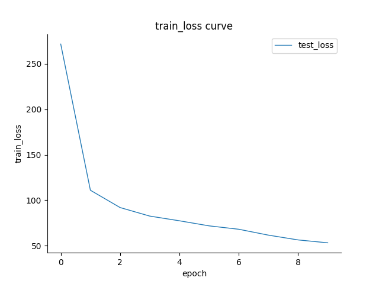

# Data Generation Method

```txt
DGM
│  add_noise.py//人工加噪函数，用于测试抗噪损失函数的性能
│  generator.py//生成数据代码
│  GLM_Dataset.csv//生成数据集
│  IMDB_Dataset.csv//原始数据集
│  Readme.md
│
├─ChatGLM3-main
│
├─Langchain//使用LangChain优化数据生成任务的代码
│      chatGLM.py
│
├─LSTM//使用单项LSTM测试生成数据的质量
│  │  GLM_Dataset.csv
│  │  GLM_train.py
│  │  IMDB_Dataset.csv
│  │  IMDB_test_Dataset.csv
│  │  IMDB_train.py
│  │  IMDB_train_Dataset.csv
│  │  noise-tolerant_train.py
│
└─source
```


## ChatGLM-6B/ChatGLM3-6B的本地部署

### step1:代码下载

[GitHub - THUDM/ChatGLM-6B: ChatGLM-6B: An Open Bilingual Dialogue Language Model | 开源双语对话语言模型](https://github.com/THUDM/ChatGLM-6B)

[GitHub - THUDM/ChatGLM3: ChatGLM3 series: Open Bilingual Chat LLMs | 开源双语对话语言模型](https://github.com/THUDM/ChatGLM3)

### step2:模型参数的下载

[THUDM/chatglm-6b at main (huggingface.co)](https://huggingface.co/THUDM/chatglm-6b/tree/main)

[THUDM/chatglm3-6b at main (huggingface.co)](https://huggingface.co/THUDM/chatglm3-6b/tree/main)

### step3:配置依赖的python库和版本

```shell
pip install -r requirements.txt
```

### step4:运行demo文件

```shell
python cli_demo.py
```

## 数据生成调试日志

### 生成程序

```shell
python generator.py
```

### version1.0

#### query

```
你现在是一个文本情感数据生成器，生成的数据应为关于影视剧的英文影评和与该影评情感倾向匹配的标签，同时不能从已有的数据集中摘取，标签为positive或negative，你需要生成5条互不相同的但类似的数据，同时给出符合数据内容情感倾向的标签
```

#### problem

没完全遵循指令：1.出现了重复的数据内容；2.生成的评论的逻辑有时候比较怪，不像人说出来的话；3.与示例的相似度大，具体体现为生成的全是positive的标签、内容围绕这绿野仙踪展开。

### version2.0

#### query

```
f"你现在是一个文本情感数据生成器，数据生成的要求为：" \
        f"1.生成的数据应为关于影视剧的英文影评和与该影评情感倾向匹配的标签(positive或negative)" \
        f"2.不能从已有的数据集中摘取" \
        f"3.你需要生成5条数据，同时给出符合数据内容情感倾向的标签" \
        f"4.数据格式为：text:数据内容;label:positive或negative" \
        f"以下是参考范例：text:{text};label:{label}"
```

#### problem

只生成了四条数据，且标签都是positive，体现了同范例的相似性

### version3.0

#### query

```text
f"你现在是一个文本情感数据生成器，数据生成的要求为：" \
                        f"1.生成的数据应为关于影视剧的英文影评和与该影评情感倾向匹配的标签(positive或negative)" \
                        f"2.不能从已有的数据集中摘取" \
                        f"3.你只需要生成1条数据，同时给出符合数据内容情感倾向的标签" \
                        f"4.数据格式为规范的json格式，能够被json.loads直接处理" \
                        f"以下是参考范例：text:{text};label:{label}"
```

#### problem

尽管对格式提出了要求，GLM生成的内容有时还是会不符合格式规范。

### version4.0

#### query

```text
f"你现在是一个文本情感数据生成器，以下是参考范例：" \
                        f"{{\"text\":\"{text}\",\"label\":\"{label}\"}}" \
                        f"数据生成的要求为：" \
                        f"1.text应为关于影视剧的英文影评，label应为与text情感倾向匹配的标签(positive或negative)" \
                        f"2.不能从已有的数据集中摘取" \
                        f"3.你只需要生成1条数据，text的内容需要符合json格式规范，因此若要使用引号记得转义" \
                        f"4.数据格式和范例一致" \
                        f"5.生成内容为纯英文"
```

#### problem

格式不规范的问题得到了有效地解决，但是无论怎么设计prompt，GLM始终无法对内容中的引号做转义处理，导致部分数据解析失败，但成功率已经比以往高很多了。

### version5.0

#### query

```python
query = f"You are now a text sentiment data generator, here is a reference example:" \
        f"{{\"text\":\"{text}\",\"label\":\"{label}\"}}" \
        f"The requirements for generating data are as follows:" \
        f"1.The text should be an English review about a movie or TV show, and the label should match the sentiment tendency of the text (pos or neg)." \
        f"2.You only need to generate one piece of data, and the content of the 'text' field should comply with the JSON format. Remember to escape quotes if you want to use them." \
        f"3.The data format should completely match the example provided." \
        f"4.Your response should be in English." \
        f"5.Try to maintain a difference of over 30% compared to the data generated previously"
```

#### problem

即使是全英文对话，模型偶尔还是会回复中文，说明大模型训练过程中中文数据对其影响很大。

即使调高了temperature，并在prompt中明确不能和上一个回复相似度大于30%，模板化回复还是很高【有待研究】

数据有效率约在70%左右，较过去的版本有所提升

## LSTM文本情感模型的搭建

### torchtext的配置

```shell
pip install pqi
pqi use aliyun
pip install torchtext==0.6
```

过高版本的torchtext删除了field，不会用；其次，删除pytorch，直接下torchtext似乎会自动把匹配版本的pytorch给下好。

### 数据预处理

使用pandas进行数据预处理：因为GLM生成的数据存在格式问题，比如GLM会随机用pos或positive等来表示积极的情感

```python
import pandas as pd
#数据读入
dataset = pd.read_csv("IMDB Dataset.csv", engine= "python", header= None, encoding='gb18030')
#常用功能
print(dataset.info())
print(dataset.describe())#数据表的描述
print(dataset.columns())#列名
print(dataset.head())#默认显示前五行
#数据导出
dataset.to_csv("tmp1.csv", header= None, index= None)
```

### 数据读入

1.从csv读入

原始数据集的内容和编码有一定问题

```python
from torchtext import data
LABEL = data.LabelField()
TEXT = data.Field(lower= True)
#设置表头
fields = [('text', TEXT), ('label', LABEL)] #如果某列不需要就设置为None
ContentDataset = data.TabularDataset(
    path = "tmp1.csv",
    format = 'CSV',
    fields = fields,
    skip_header = True #设置是否跳过表头
)
```

2.从pytorch库中读入

```python
# 加载IMDB电影评论数据集
from torchtext import datasets
train_data, test_data = datasets.IMDB.splits(TEXT, LABEL)
train_data, valid_data = train_data.split(random_state=random.seed(SEED))
```

### 分割数据集

```python
train, test, val = ContentDataset.split(split_ratio=[0.8, 0.1, 0.1], strata_field="label")
```

### 构建词汇表

```python
vocab_size = 20000
TEXT.build_vocab(train, max_size=vocab_size) #默认会添加unk --> 未知单词, pad --> 填充
LABEL.build_vocab(train)
```

1. 查看词汇表中最常见的单词

   ```
   TEXT.vocab.freqs.most_common(10)
   ```

2. 索引到单词

   ```
   TEXT.vocab.itos[:10]
   ```

3. 单词到索引

   ```
   TEXT.vocab.stoi
   ```

## SUNGEN：基于抗噪声损失函数的模型训练框架

## 实验

### 损失及准确率变化曲线

#### IMDB数据集


#### GLM_dataset生成数据集


#### 人为添加10%随机标签噪声下的生成数据集

##### 添加抗噪损失函数




##### 未添加抗噪损失函数


